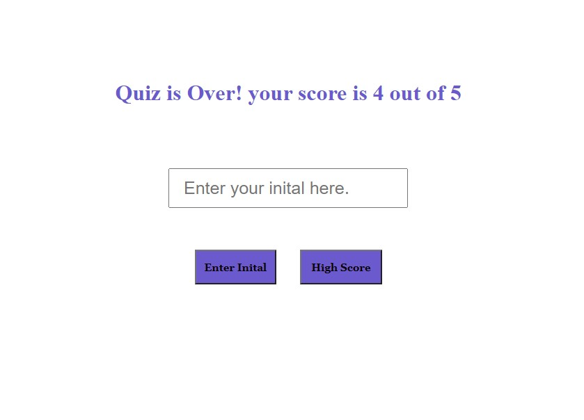

# Timed-Quiz

## Purpose: Timed quiz for JavaScript 

### Description: 
The beginning of the assessment shows the instructions:
* Start: To start the quiz and start 90 seconds countdown.
* When the user answer, the next question and answers will show up.
* When the user answer, the result will show correct or wrong.
* If the answer is wrong, time will decrease by 5 seconds as a penalty.
* If time is over and the user does not finish the quiz, the quiz will be over.
* When the quiz is over, the score will display with input text and two buttons Enter initial and High score.
* Pressing on Enter initial allows saving the initial.
* Pressing on Highscore shows a list of scores.

## Instructions:
At The end of the quiz, Enter initials to save the user initial and score. 
The High Score button displays a list of saved initials and scores, 
as  following snips:

 

## Website
 https://ghaliarose89.github.io/password-generator/

### Contribution
Made with ❤️️ by Ghalia

### ©️ [2021] [Ghalia Sami]
