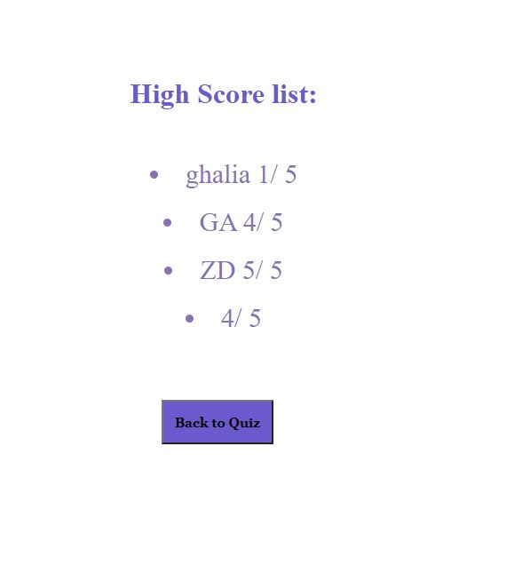

# Timed-Quiz

## Purpose: Timed quiz for JavaScript 

### Description: 
The begining assement shows the instrictions:
* Start: To start the quiz and start 90 seconds countdown.
* When the user answer, next question and answers will show up.
* When the user answer, the result will show correct or wrong.
* If the answer is wrong time will decrease 5 seconds as panelty.
* If time is over and the user not finish the quize, quize will over.
* When quiz is over, score will display with input text and two buttons Enter inital and Highscore.
* Pressing on Enter allows to save inital.
* Pressing on Highscore shows a list of scores.

## Instructions:
At the end of the quiz, Enter initals to save user inital and score.
Highscore button displays a list of saved initals and scores like the following snip: 
 
 

## Website
 https://ghaliarose89.github.io/password-generator/

### Contribution
Made with ❤️️ by Ghalia

### ©️ [2021] [Ghalia Sami]
